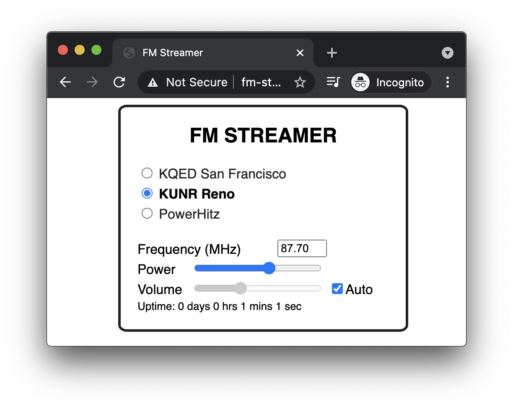
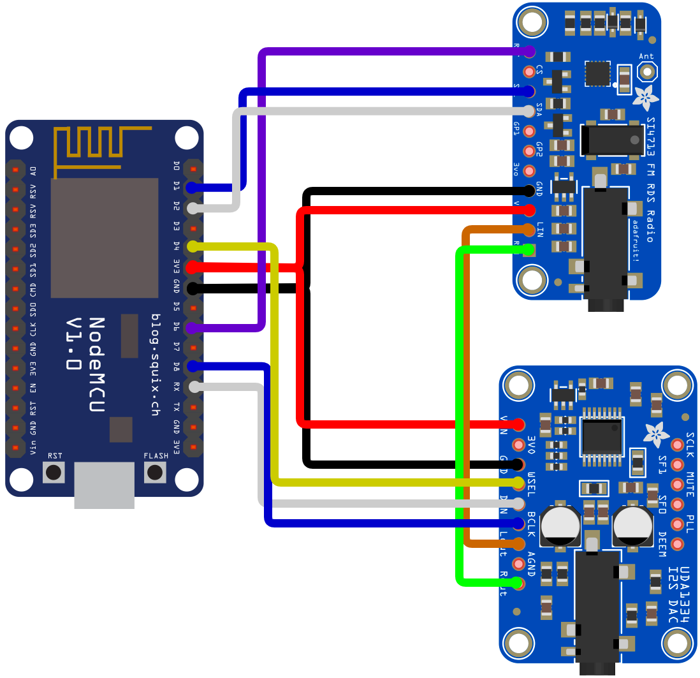
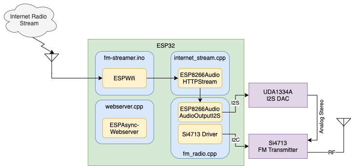

# FM Streamer
Are there not a lot of good FM radio stations in your vicinity? Have you ever wished you could receive your hometown station on your FM radio while you're away? Well this is the project for you!

This is a simple ESP32/ESP8266 project that grabs an MP3 internet stream and bridges it to an FM transmitter, so that you can listen to the stream on your old-school FM radio.

# Setup
If you're on Linux or Mac (or any system with GNU Make installed), install [arduino-cli](https://github.com/arduino/arduino-cli). This project is set up to work out of the box with it, and this will save you having to set up the ESP32/ESP8266 and required libraries in your Arduino IDE.

1. Run `make config-tools` to install libraries and ESP32/ESP8266 core.
1. Rename `arduino_secrets.h.example` to `arduino_secrets.h` and change the wifi SSID and password in it to match the network you wish to attach to.
1. If you want to change the radio streams, edit them in the `StationList` struct in fm-streamer.ino.
1. Power on your board, connect its serial port to your computer, and see how the serial port comes up on your computer (e.g., `/dev/cu.usbserial-xxxx` or `COM1`, etc.). You'll use this value in the next step
1. Run `make program SERIAL_PORT=<serialport> MCU_TYPE=<esp32|esp8266>` (replacing \<serialport\> with the name of the serial port from the previous step, and using either "esp32" or "esp8266" as the MCU_TYPE) to compile the code and upload it to your board.

# Usage
Once you've followed the above steps and your board is programmed, the FM Streamer should connect to your wifi network, begin streaming the first mp3 stream in `StationList` (defined in webserver.h), and automatically broadcast over FM. There is a status output on the serial console that will tell you what's going on with the board as well.

I've implemented a web interface to the FM Streamer that allows you to control the station, volume, and transmit power of the FM Streamer. Note that this doesn't work on the ESP8266, as it runs out of RAM between the web server and audio streaming. However, it works well on the ESP32. Here's what it looks like:

---

# Under the Hood
This project consists of three hardware components:
1. [ESP32 dev board](https://www.amazon.com/dp/B08D5ZD528) or [ESP3266 NodeMCU v1.0](https://www.amazon.com/gp/product/B010O1G1ES/)
1. [Adafruit UDA1334A I2S Stereo DAC breakout board](https://www.adafruit.com/product/3678)
1. [Adafruit Si4713 FM Transmitter breakout board](https://www.adafruit.com/product/1958)

## Hardware
These are wired together like so (for the ESP32):

Everything is powered from the ESP32 board's 3.3V output. The Si4713 FM transmitter is connected to the ESP32 over I2C, the UDA1334 DAC is connected to it over I2S, and then the UDA1334 DAC outputs audio to the Si4713 transmitter via analog stereo audio.

I also wired a 4.7kΩ resistor from each of the DAC's analog audio outputs to GND to provide a bit of loading for it. I found that this helped reduce noise and clipping on the FM transmitter's input, although I did not experiment much with values or whether this is truly necessary.

## Software
The software makes use of the [ESP8266Audio](https://github.com/earlephilhower/ESP8266Audio) library and [Adafruit's Si4713](https://github.com/adafruit/Adafruit-Si4713-Library) driver. The webserver uses the [ESPAsynWebserver](https://github.com/me-no-dev/ESPAsyncWebServer/) library.

